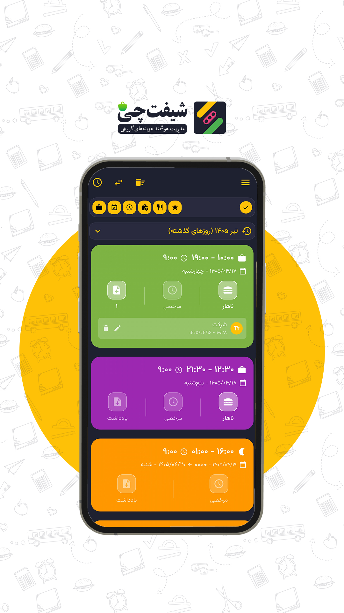

# Shiftchi

**Professional Work Shift Management App**

  

---

## About Shiftchi

Shiftchi is a smart application for managing work shifts. It helps users easily record and manage their shifts and sync them with Google Calendar.

### Features
- 📊 Work shift management
- 🔔 Smart reminders
- 📅 Google Calendar sync
- 📈 Reports and work statistics
- 💾 Backup and data recovery
- 🌙 Day/Night mode
- 🔐 Google Sign-In for Google Calendar sync

### Built With
- **Flutter** — Cross-platform mobile app framework
- **Google Sign-In** — Secure authentication for Google Calendar integration

---

## Download

| Platform | Download Link |
|----------|--------------|
| 📥 Direct Download | [shiftchi.fuladpanjeh.ir](https://shiftchi.fuladpanjeh.ir/) |
| 🟢 Cafe Bazaar | [cafebazaar.ir](https://cafebazaar.ir/app/ir.shiftchi.app) |
| 🔵 Myket | [myket.ir](https://myket.ir/app/ir.shiftchi.app) |

---

## Useful Links

- [Privacy Policy](privacy-policy-en.md)
- [Terms of Service](terms-of-service-en.md)

---

## Contact

- **Email:** takbaran.com@gmail.com

---

© 2026 Shiftchi. All rights reserved.
